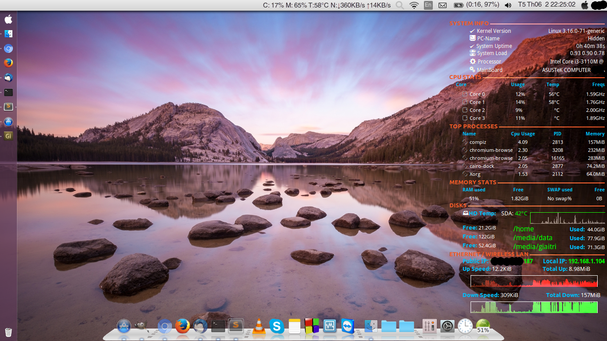

conky
=====
Screenshots

Installation on Ubuntu 14.04
====
The following packages are used by the script:
* conky-all
* lm-sensors
* hddtemp
* dmidecode
* ...

Install:
<pre># sudo apt-get install conky-all lm-sensors hddtemp</pre>

Fonts:
====
* STYLBCC.ttf
* Poky.ttf

How to Use:
====
<pre># conky -c path_to_file &</pre>

Notes: 
===
* I was used and edited "conky-seamod" with my favorite. You can see more here: https://hrshadhin.wordpress.com/2014/01/03/install-conky-conky-theme-seamod-mix-on-linux/ 
* You can change a little things to appropriate with your computer. Maybe about fonts, size or resolution (1366x768 in used) ...
* I will update with weather and theme config later.

